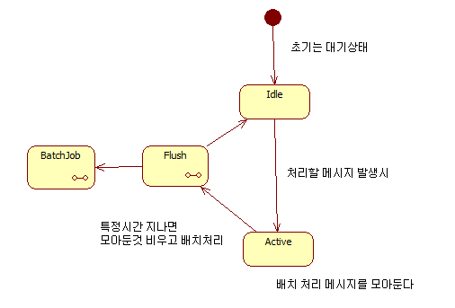

# 배치처리를 우아하게 하기

대용량 데이터를 배치(인입) 처리하기 위해 성능문제는 중요하며

다음과 같은 선택 포인트가 있습니다.

- ORM VS 저순준 DAO
- 건바이건 VS 벌크처리

이와 관련해서는 아래 아티컬을 읽어봅니다.

[성능에대한 고찰-JAVA진영](https://homoefficio.github.io/2020/01/25/Spring-Data%EC%97%90%EC%84%9C-Batch-Insert-%EC%B5%9C%EC%A0%81%ED%99%94/)

[성능에대한 고찰-NET진영(유료)](https://entityframework-extensions.net/bulk-insert)

## 스트림 배치처리

배치처리는 특정 시간단위로 주기적으로 작동하여 중간 결과를 내는곳에서 여전히

중요하게 사용될수 있지만 다음과 같은 문제가 있습니다.

- 처리해야할 데이터가 많아짐에 따라 배치주기는 메모리오버플로우를 막기위해 더 짧아지고 있습니다.
- 최대 트래픽 피크 구간을 예측할수 없으며, 트래픽이 많은구간에서 작동하는 배치Task는 일시적으로 많은 CPU와 네크워크 벤더 리소스를 사용하게 됩니다.
- 사용자는 더 빠른 피드백을 원하며, 실시간성 집계결과에 사용하기에는 적합하지 않습니다.

위와같은 문제를 해결하기위해, 상태머신을 활용한 FSM 배치처리가 필요합니다.

### FSM 배치 처리기

기능요약

- 처리할 이벤트발생시 즉각 처리하지 않고 큐에 담아둡니다.
- 지정된 초만큼 받은데이터만 처리를 합니다.

여기서 제공되는 모듈로 심플하게 구현가능하며
유닛 테스트로 스스로 작동을 설명하는 샘플코드를 확인할수 있습니다.
    
        public class BatchActorTest : TestKitXunit
        {
            protected TestProbe probe;

            public BatchActorTest(ITestOutputHelper output) : base(output)
            {
                Setup();
            }

            public void Setup()
            {
                //배치가 컬렉션단위로 잘 수행하는지 관찰자 셋팅
                probe = this.CreateTestProbe();
            }

            // 테스트목적 : 이벤트가 발생할때마다 DB저장이 아닌, 특정시간 수집된 구간의 데이터 벌크인서트처리목적(벌크인서트는 건바이건보다 빠르다)
            // 벌크를 만드는 주기를 3초(collectSec)로 지정..
            [Theory(DisplayName = "배치처리는_특정시간구간_일괄처리한다")]
            [InlineData(3)]
            public void Test1(int collectSec)
            {
                //배치처리기 생성
                var batchActor = Sys.ActorOf(Props.Create(() => new BatchActor(collectSec)));

                //배치저리 담당자 지정 : 배치처리를 수행하는 액터등록
                IActorRef batchWriterActor = Sys.ActorOf(Props.Create(() => new TestBatchWriterActor(probe)));
                batchActor.Tell(new SetTarget(batchWriterActor));

                //이벤트는 실시간적으로 발생한다.
                batchActor.Tell(new Queue("오브젝트1"));
                batchActor.Tell(new Queue("오브젝트2"));
                batchActor.Tell(new Queue("오브젝트3"));

                //배치 처리할것이 없는것 확인
                probe.ExpectNoMsg();

                //배치 항목을 검사 : collectSec+1초를 기다려줌            
                var batchList = probe.ExpectMsg<Batch>(TimeSpan.FromSeconds(collectSec + 1)).Obj;

                var firstItem = batchList[0] as string;
                Assert.Equal("오브젝트1", firstItem);
                Assert.Equal(3, batchList.Count);

                //이벤트는 실시간적으로 발생한다.
                batchActor.Tell(new Queue("오브젝트4"));
                batchActor.Tell(new Queue("오브젝트5"));
                batchActor.Tell(new Queue("오브젝트6"));
                batchActor.Tell(new Queue("오브젝트7"));

                //강제 벌크요청(필요하면 강제 배치처리)
                batchActor.Tell(new Flush());

                //배치 항목을 검사
                batchList = probe.ExpectMsg<Batch>().Obj;
                firstItem = batchList[0] as string;
                Assert.Equal("오브젝트4", firstItem);
                Assert.Equal(4, batchList.Count);
            }
        }

        // 특정 기간동안 집계된 컬렉션은 이 액터에게 온다.
        public class TestBatchWriterActor : ReceiveActor
        {
            protected IActorRef probe;

            public TestBatchWriterActor(IActorRef _probe)
            {
                probe = _probe;
                ReceiveAsync<object>(async message =>
                {
                    //각각 저장하고 싶은 DB에따라 배치처리를 수행한다.
                    if (message is Batch batchMessage)
                    {
                        probe.Tell(batchMessage);
                        Console.WriteLine($"====== TODO 배치수행 :{batchMessage.Obj.Count}");
                    }
                });
            }
        }

추가개선:
- Actor를 개선하여 한번에 처리해야할 Size가 클시 분할처리혹은 OverFlow를 방지 할수 있습니다. - Akka Stream
- 큐에 적재된 데이터의 실패에대해 영속성을 이용하여 재시도할수 있습니다. - Akka Persitence,Delivery Once

원문링크:
- https://doc.akka.io/docs/akka/current/fsm.html - JAVA
- https://getakka.net/articles/actors/finite-state-machine.html - NET
- https://getakka.net/articles/streams/buffersandworkingwithrate.html  - AkkaStream Buffers Amd working with Rate

