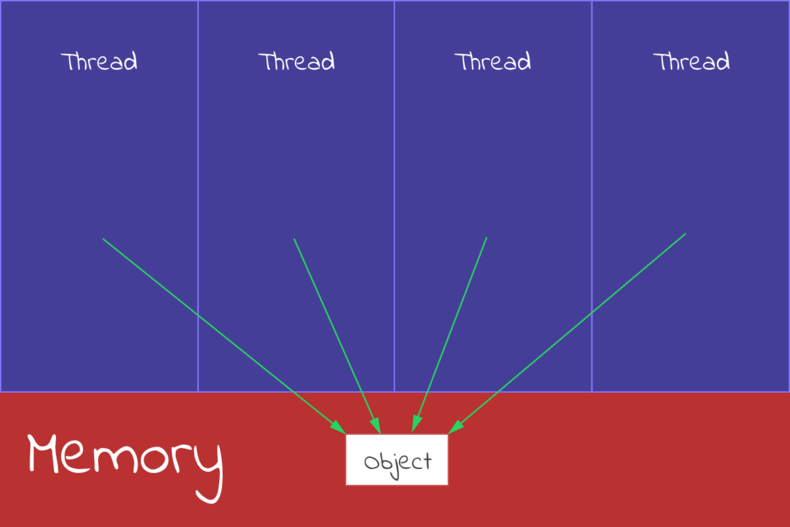
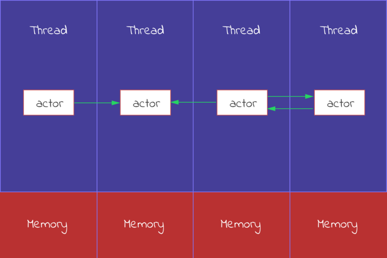

# Dispatcher

 Dispatcher는 ActorSystem 내에서 실행되는 모든 코드를 스케줄링 합니다.

각 Actor의 처리량과 시간 점유율을 조정하여 각자에게 공정한 리소스를 제공합니다.

구성 변경을 하지 않는한 일반적으로 최적화 된 ThreadPOOL을 사용합니다.

## 멀티스레딩 프로그래밍 VS Actor 프로그래밍

Dispatcher를 이해하기 앞서 멀티스레딩 프로그래밍에 대해 간략하게 알아보겠습니다.

### 멀티스레딩 프로그래밍

각기 다른 IO의 속도때문에, 싱글로 순차적으로 실행되는것이 아닌 
대용량처리를 위해 병렬적으로 실행되는 프로그래밍 모델이 필요했으며 
도메인 처리 보다는 주로 시스템에서 발생할수 있는  다음과 같은 문제를 
프로그래밍으로 풀어야 했으며 주로 기기 하나의 스펙을 업하는 스케일업에서 
유리할수 있습니다.
하드웨어 스펙의 발전으로,스케일업만으로 대용량 처리하던 시대가 끝나간것을
"공짜 점심은 끝났다" 라고도 표현합니다.

- 데드락을 피하고 공유객체를 안전하게 제어하는 방법
- 스레드를 객체를 효율적으로 생성하고 제어하는 방법
- Context 스위칭을 효율적으로 하게 하는 방법

참고자료 : https://docs.microsoft.com/ko-kr/dotnet/standard/threading/threading-objects-and-features

### 액터 메시징 프로그래밍

액터 모델에서는 공유가능한것을 죽음의 칵테일이라고 표현합니다.

멀티스레딩 프로그래밍에서 발생하는 문제에서 공유가능을 제거하고 시작하며

액터의 그누구도, 액터가 가진 객체와 공유가 불가능하며 오로지 메시지를

통해서만 알려줄수 있습니다.

OOP의 접근제어자의 특성(public,protected,private)을 액터모델에서는 이용할수 없음을 의미하며

메시징 처리 설계로 로컬과 리모트의 구현체의 차이점이 없는 것이 장점이나

역설적으로 로컬에서만 사용하는 모델이 불필요하게 어려워질수 있습니다.

CRUD만을 이용하지 않고 이벤트소싱,CQRS등 고급 패턴을 활용할수 있는 툴이제공되며(각각 장단점 존재)

단일지점 병목이 없는 스케일아웃이 중요한 분산처리 시스템에서 유용합니다.

액터 참고자료 : https://getakka.net/articles/intro/what-problems-does-actor-model-solve.html

# AKKA 시스템에서 요구하는 멀티스레딩 능력

AKKA System에서 액터프로그래밍은 멀티스레딩 프로그래밍을 요구하지 않습니다.

그렇다고 멀티스레드를 이해하지 않아도 되거나, 이용하지 말라는 의미가 아닙니다.

AKKA에서 멀티스레드를 더 안전하고 효율적으로 처리할수 있는 기능을 제공하고  

우리가 이해하는 멀티스레드 지식 보다 훨씬더 많은 이해를 하고있습니다.

Dispacher라는 기능제공 설정을 통해 성능 튜닝을 코드 변경없이 가능하게합니다.

이것은 Akka가 구현된 각언어 Scala,Net,Java 플랫폼에 최적화된 동시성,

병렬처리를 각각 이용합니다.

# Dispatcher 실제 사용

튜닝요소를 설정파일에 추가(akka.conf)

<pre>
# 기본 스레드 풀 사용 - 동시처리 10
fast-dispatcher {
	type = Dispatcher
	throughput = 10
}

# 기본 스레드 풀 사용 - 동시처리 1
slow-dispatcher {
	type = Dispatcher
	throughput = 1
}

# TPL 사용
custom-task-dispatcher {
	type = TaskDispatcher
	throughput = 10
}

# 스레드풀 사용전략 직접 지정
custom-fork-join-dispatcher1 {
	type = ForkJoinDispatcher
	throughput = 100
	dedicated-thread-pool {
		thread-count = 1
		deadlock-timeout = 3s
		threadtype = background
	}
}

custom-fork-join-dispatcher2 {
	type = ForkJoinDispatcher
	throughput = 100
	dedicated-thread-pool {
		thread-count = 2
		deadlock-timeout = 3s
		threadtype = background
	}
}
</pre>

액터의 성능을 위해 다양한 스레드풀을 이용하며, 튜닝가능합니다.

코드내 구현은 단지, WithDispatcher로 액터와 연결하면 됩니다.

            var delayActor_fast2 = Sys.ActorOf(Props.Create(() => new DelayActor("delayActor_fast2"))
                .WithDispatcher("custom-fork-join-dispatcher2")
            );

            var delayActor_slow1 = Sys.ActorOf(Props.Create(() => new DelayActor("delayActor_slow1"))
                .WithDispatcher("custom-fork-join-dispatcher1")
            );

## Dispatcher 성능튜닝

일반적으로 액터를 튜닝할 필요는 없으나
FastActor그룹은 스레드2개를 사용, SlowActor그룹은 스레드 1개만을 사용지정하여
액터의 성능을 다르게 할수 있습니다.

<pre>
[Sec-53] [TID-26] [delayActor_fast1] : fast0
[Sec-53] [TID-27] [delayActor_fast2] : fast0
[Sec-53] [TID-28] [delayActor_slow1] : slow0
...........................중간생략
[Sec-9] [TID-28] [delayActor_slow2] : slow0
[Sec-10] [TID-28] [delayActor_slow2] : slow1
[Sec-12] [TID-28] [delayActor_slow2] : slow2
</pre>

- Dispatcher 실험 : [DispatcherTest](../TestAkkaDotModule/TestActors/BatchActorTest.cs)

# 추가 참고자료

성능과 관련하여 동시성 처리를 위한 스케줄러 역활을 하는 Dispatcher는 

AKKA에서만 존재하는 컨셉은 아니며

오라클 성능튜닝을 할때도 중요한 역활을 하는것이 Dispatcher이며

이것은 멀티스레딩 프로그래밍 능력자체를 요구하는것은 아니지만

멀티스레드를 이해하면 도움이됩니다.

- 원문 참고 :[dispatchers](https://getakka.net/articles/actors/dispatchers.html  ) 
- 오라클 Dispatcher : https://secmaster.tistory.com/20
- Dispatcher 변종실험 : http://wiki.webnori.com/display/webfr/Using+Dispacher

