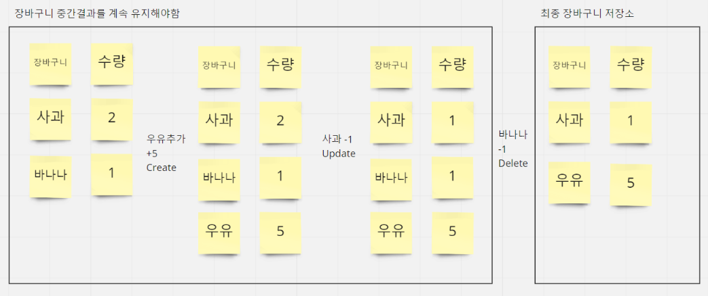
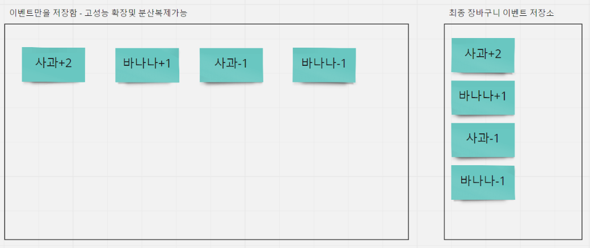
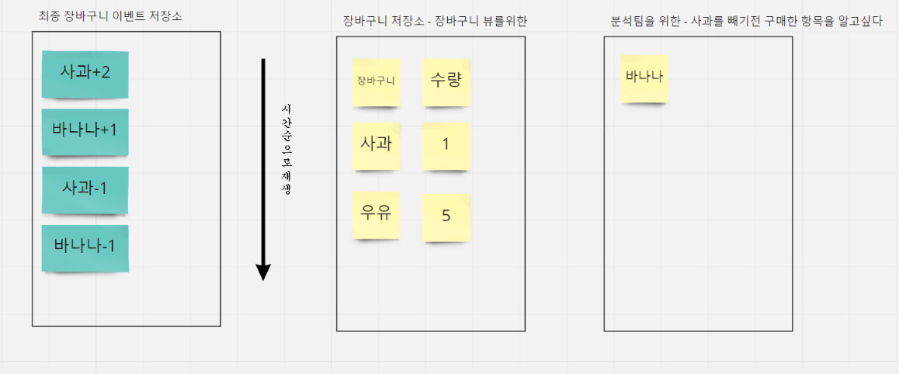
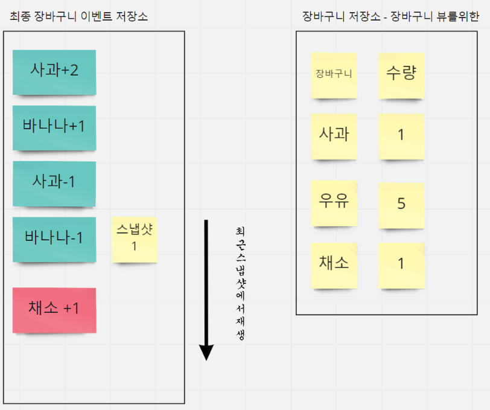

# EventSourcing

이벤트 소싱의 개념을 살펴보고

실천형 아키텍트를 위해 AKKA.net를 통해 실행가능한 코드 샘플도 살펴보겠습니다.


# CRUD와 차이점

이벤트 소싱을 이해하기위해, 전통적인 CRUD(Create Read Update Delete)방식에 대해 이해가 필요합니다.

CRUD는 일반적으로 어떤 로직을 처리하고 그 결과값만을 저장합니다.



전통적인 방식이며 대부분의 데이터 처리에 적합하며

도메인 또는 비즈니스 규칙이 간단하거나, CRUD인터페이스로 충분할때

이용될수 있습니다.

하지만 비즈니스모델은 점점 변화하며 계속 생겨나게됩니다.
처음 설계한 제약과 규칙을 성능과 함께 계속 유지변경해야하며
다음과 같은 문제가 생길수 있을때 이벤트 소싱(또는 DDD+CQRS)을 고려해볼수 있습니다.

- 무결성을 유지하면서 결과를 계속 유지하는것은 단일지점 성능비용이 듭니다.
- 분석팀에서 사용자가 바나나를 제거했다란 사실을 찾을수가 없습니다.
- 바나나를 찾기위한 기능을 구현하기위해 상류팀에서는 새로운 CRUD를 또 작성하게됩니다.
- 새로운 기능이 추가되었다고 해도,과거에 발생한 이벤트를 찾을수 없습니다.


# 이벤트 저장



이벤트 소싱은 커다란 웹사이트를 수십억명의 사용자 규모로 확장하는 아이디어이며

이 아이디어는 매우 간답합니다. 메시지가 발생할때 명령의 이벤트 목록을 생성하고 저장을 합니다.

이 계획은 이벤트만이 저장소에 추가되고 아무것도 변이되지 않는 점이며 

이를 통해 이벤트 스트림의 소비자를 완벽하게 복제하고 확장할수 있습니다. 

이벤트 소싱을 실현하기 위해서, AKKA에서 PersistenceActor 가 사용이 됩니다.

# 이벤트 재생(스트림 소비자)



이벤트를 받아 명령을 생성하고 저장하는 팀과 그것을 활용하여 이용하는팀은 다를수 있으며

MSA 책임분리 단위에도 적합하며, 요즘 대세인 KAFKA의 생산과 소비의 분리라는 컨셉과도 유사하며

대용량 메시지 전송이만이 아닌 대용량 서비스를 설계할수도 있습니다.


간략하게 활용요소를 재요약하면

- 이벤트 소싱 : 지금까지 설명한 메시징 개발 패턴
- KAFKA : 이때 이용할수 있는 원격전송 메시징 시스템
- AKKA-EventSourcing : 이벤트 소싱 구현을 도와주는 어느정도 추상화된 개발 툴킷


이벤트 스트림을 소비하는 개발팀에서는, 이벤트 재생을 통해 다양한 기능을 독립적으로 만들어 낼수 있습니다.

이벤트 소싱은 CQRS의 일부로 이러한 명령과 조회 책임의 분리는 정확하게는 CQRS에서 이야기하고 있는내용입니다.

    영역이 약간 다르지만, 쉬운예로 스타크래프트의 리플레이 재생기를 통해 이해하면 쉬울것같습니다.

    스타크래프트 리플레이기의 소스를 볼수없지만 CQRS와 이벤트 소싱을 이해하기 좋은 예이며

    게임중 게임에 발생하는 이벤트 자체만을 저장하고 게임이 끝난후 게임플레이를 볼수 있습니다. (저장과 재생의 책임분리)

    하지만 다양한 서드파티 개발자들은 이 이벤트를 활용하여 

    APM측정,자원효율분석기,시간대별 생산량등 다양한 기능을 독립적으로 만들어낼수 있습니다.(이벤트소싱)

    또한 이것은 리마스터를 통해 더 좋은 그래픽으로 재생될수 있습니다.


## CQRS 살펴보기

CQRS(명령 및 쿼리 책임 분리)는 Greg Young이 소개하고 Udi Dahan 및 다른 사용자가 전적으로 지원했습니다.

EventSourcing는 CQRS에서 파생된 개발패턴이며

이것에 대한 DDD내에서 활용하는 구현체는 Implementing Domain-Driven Design(반버논저서)에서 자세하게 구현되어 있습니다.

CQRS는 다음링크를 참고합니다

Link : 
- [CQRS+DDD](https://docs.microsoft.com/ko-kr/dotnet/architecture/microservices/microservice-ddd-cqrs-patterns/apply-simplified-microservice-cqrs-ddd-patterns)
- [Greg-young](https://dddeurope.com/2017/speakers/greg-young/)


# 이벤트 스냅샷



이벤트 소싱의 단점으로, 너무많은 이벤트를 재생하게 될시 재생성능이 느려질수 있습니다.
이에 대한 보완으로 중간처리를 집계하는 스냅샷을 사용하게 됩니다.
스냅샷이후 부터재생하여 최종결과를 빠르게 재생할수 있습니다.


# 구현부 - AkkaPersitentActor 활용

위 컨셉이 이해되면 다음 구현부를 사용하여 이벤트 소싱을 작동시킬수 있습니다.

Akka의 PersistentActor는 이벤트 소싱구현을 위한 기능을제공해줍니다.

```c#
    public class PersistentActor : UntypedPersistentActor
    {
        private ExampleState _state = new ExampleState();
 
        private void UpdateState(Evt evt)
        {
            _state = _state.Updated(evt);
        }
 
        private int NumEvents => _state.Size;
 
        public override Recovery Recovery => new Recovery(fromSnapshot: SnapshotSelectionCriteria.None);
        protected override void OnRecover(object message)
        {
            switch (message)
            {
                case Evt evt:
                    UpdateState(evt);
                    break;
                case SnapshotOffer snapshot when snapshot.Snapshot is ExampleState:
                _state = (ExampleState)snapshot.Snapshot;
                    break;
            }
        }
 
        protected override void OnCommand(object message)
        {
            switch (message)
            {
                case Cmd cmd:
                    Persist(new Evt($"{cmd.Data}-{NumEvents}"), UpdateState);
                    Persist(new Evt($"{cmd.Data}-{NumEvents + 1}"), evt =>   //이코드는 복제와 추가행동 전략과 관련있습니다.
                    {
                        UpdateState(evt);
                        Context.System.EventStream.Publish(evt);
                    });
                    break;
                case "snap":
                    SaveSnapshot(_state);
                    break;
                case "print":
                    Console.WriteLine("Try print");
                    Console.WriteLine(_state);
                    break;
                case Shutdown down:
                    Context.Stop(Self);
                    break;
            }
        }
 
        public override string PersistenceId { get; } = "sample-id-1";  //영속성을 위한 고유한 아이디값을 가집니다.
    }
 ```

- 이벤트 소싱구현 : https://getakka.net/articles/persistence/event-sourcing.html
- 스냅샷 구현: https://getakka.net/articles/persistence/snapshots.html
- 작동확인 : http://wiki.webnori.com/display/webfr/EventSourcing


# 이벤트의 복구

이벤트 소싱에서, 이벤트자체가 서비스 기능으로 이용됨으로 이벤트 하나하나가 중요합니다.
CRUD가 무결성유지를 위해 제약에 공을 들인다고 하면, 이벤트 소싱은 이벤트 자체의 유실을 막기위한
이벤트 영속성에 조금더 공을들이게 됩니다. 
그리고 이것은 단일지점 저장소에 의존하지 않으며, 메모리/로컬저장소/원격저장소등
사용자가 어플리케이션에서 도메인구현을 설계하여 대용량 분산처리가 될수 있도록 합니다.

이벤트 소싱에서는 이벤트와 로그가 이분화되어있는것이 아닌 이벤트가 곧 로그가 될수 있습니다.

## 유닛테스트로 살펴본 이벤트 복구

```c#
using Akka.Actor;
using Akka.TestKit;
using AkkaNetCoreTest;
using System;
using System.Threading.Tasks;
using Xunit;
using Xunit.Abstractions;

namespace TestAkkaDotModule.ActorSample
{
    public class PersistentActorTest : TestKitXunit
    {
        protected TestProbe probe;

        protected IActorRef persistentActor;

        public PersistentActorTest(ITestOutputHelper output) : base(output)
        {
            Setup();
        }

        public void Setup()
        {
            //여기서 관찰자는 장바구니에 담긴 상품수를 검사할수 있습니다.
            probe = this.CreateTestProbe();

            persistentActor = Sys.ActorOf(Props.Create(() => new MyPersistentActor(probe)), "persistentActor");
        }

        //이벤트 소싱 테스트
        [Theory(DisplayName = "이벤트소싱-이벤트는 상태화되고 재생되고 복구되어야한다")]
        [InlineData(5)]
        public void Test1(int cutoffSec)
        {
            // usage
            int expectedCount = 2;

            //선택 장애 장바구니 이벤트
            Cmd cmd1 = new Cmd("장바구니를 물건을 담음+1");
            Cmd cmd2 = new Cmd("장바구니에 물건을 뺌-0");
            Cmd cmd3 = new Cmd("장바구니에 물건을 담음+1");
            Cmd cmd4 = new Cmd("장바구니에 물건을 담음+2");

            Within(TimeSpan.FromSeconds(cutoffSec), () =>
            {
                persistentActor.Tell(cmd1);
                persistentActor.Tell(cmd2);
                persistentActor.Tell(cmd3);
                persistentActor.Tell(cmd4);
                persistentActor.Tell("print"); //현재까지 액터가 가진 이벤트리스트를 재생합니다.
                Assert.Equal(expectedCount, probe.ExpectMsg<int>());

                //액터를 강제로 죽입니다.
                persistentActor.Tell(Kill.Instance);
                Task.Delay(500).Wait();

                //시스템 셧다운후,재시작 시나리오
                //액터를 다시생성하여, 액터가 가진 이벤트가 복구되는지 확인합니다.
                persistentActor = Sys.ActorOf(Props.Create(() => new MyPersistentActor(probe)), "persistentActor");
                persistentActor.Tell("print");
                Assert.Equal(expectedCount, probe.ExpectMsg<int>());

            });
        }
    }
}
```
- [PersistentActorTest](https://github.com/psmon/AkkaForNetCore/blob/master/AkkaNetCore/Actors/Study/PersistentActor.cs)

## Storage Plugins

AKKA의 Persitence는 실시간 메시지를 영속화 하려는 스택중에하나이며
아무런 설정이 없으면 기본으로 인-메모리에서 작동합니다.
메모리는 어플리케이션 종료시 휘발됨으로 
안정적인 이벤트 소싱과/스냅샷 구현을 위해서 메모리가 아닌 Staorage를 선택하는것이 권장됩니다.

- [Storage-plugins](https://getakka.net/articles/persistence/storage-plugins.html)


# 기타참고자료
- KAFKA with CQRS : https://www.confluent.io/blog/event-sourcing-cqrs-stream-processing-apache-kafka-whats-connection/
- CQRS : https://justhackem.wordpress.com/2016/09/17/what-is-cqrs/
- MSDN : https://docs.microsoft.com/ko-kr/azure/architecture/patterns/cqrs
