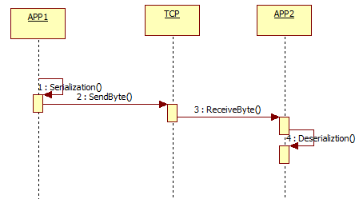
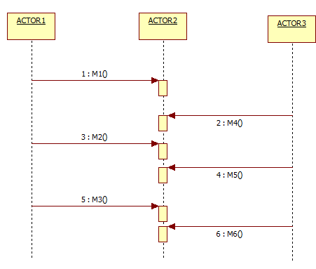
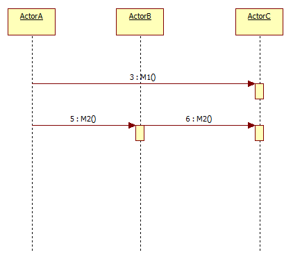

# MessageDeliveryReliability

## Remote 전송의 이해

수많은 노드로 규모를 확장하는것이, AKKA 메시지의 궁극적인 목표입니다.

여러분의 로컬에서만 실행되는 코드를 하나도 바꾸지 않고 분산시스템에서 실행되게 할수 있을까요?

짧게 답하면 '아니오' 입니다. 로컬과 원격의 환경차이를 그냥 추상화해서 없애 버릴수는 없습니다.

다음과 같은 무시할수 없는 네 영역이 있기때문입니다.

- 지연시간: 노드사이의 네트워크를 통해 전송되는 지연시간을 예측할수 없습니다.
- 부분실패: 분산 시스템을 이루는 각 부분을 항상 감시할수없으며, 각 부분이 제대로 작동하는지 알아내기가 어렵습니다.
- 메모리접근: 로컬에서는 메모리 객체에대한 참조를 항상 얻을수 있지만, 원격 노드의 원격객체에대한 참조를 얻는 것은 어럽습니다.
- 동시성: 원격노드를 조정하는 모든 권한을 가지는 주인이 없으며, 연산순서를 보장받기가 어렵습니다.

## Local전송 Vs Remote 전송

 Actor는 Local처리(전송)과 Remote 전송하는 사용방법이 거의 동일합니다.

액터처리방식에서는 동일하지만, Remote로 작동시 네트워크로인한 몇가지 차이점이 존재합니다.

- Remote의 경우 처리 대역폭에따라 네트워크 지연발생할수 있음
- Local에서는 제한없는 메시지 크기가 Remote에서는 크기제한 필요
- Remote의 경우 전송성능을 위해 TCP처리모듈, 바이너리데이터 해석을위해 Serialization 등의 모듈이 선택이가능합니다.(옵션선택사항)
- Local에서의 전송장애는 실제 네트워크사용은 없기때문에 메모리(메모리풀)문제로 인해 발생할수 있으며, Remote의 경우는 네트워크 단절(Disconnect)에의해 발생할수 있습니다. 

## 손실고려 전송방법

- at-most-once delivery ( 한번에 한번씩 배달 )
- message ordering per sender - recceiver pair  ( 메시지 순서를 고려하여 작은단위 지속적 배달 )

### at-most-once delivery 의 세부적 의미

- at-most-once : 한번만 전송하기 때문에 메시지가 유실될수 있습니다.
- at-least-once : 적어도 한번 보내려고, 여러번 보낼수 있기때문에 유실은 없지만, 중복 발생할수 있습니다.
- exactly-once : 정확하게 한번 보내려는 메카니즘으로, 중복이나 유실이 없습니다.

### 메시지 배달 보장을 위한 체크포인트

- 메시지가 네트워크에서 전송여부?
- 다른 호스트에서 수신여부?
- 수신이 되었고 메시지가 처리 큐에 저장이 되었는지 여부?
- 처리큐에서 메시지를 빼서 성공적으로 처리가 되었는지 여부?

이들 각각은 해결을 위해 서로 다른 비용을 지불하게되며,  메시지 전달라이브러리가

준수할수 없는 조건이 있다는것은 명백합니다. 보낸 사람이 성공적으로 상호작용이 성공했는지

여부를 알수 있는 유일한 방법은 비지니스수준의 승인 메시지를 확인하는 것이며 

AKKA자체로 만회할수 있는 것이 아닙니다. AKKA는 분산 컴퓨팅을 채택하고  메시지전달을통해

명시적으로 통신의 오류를 체크하며, 전달 보증을 위해 추상화된 거짓처리를 하지 않습니다. 

메시지 전달은 항상 보장되는게 아니며, AKKA는 메시지전달에 최소한 "보증"및 체크 수준을 제공해주고

사용자가 그것을 응용프로그램에 설계를 해야합니다.

이것은  Erlang에서 크게 성공을 거둔 기법입니다. ( http://erlang.org/faq/academic.html#idp32880720  - 10.9)

## Higher-level abstractions

AKKA의 메시지는 강력하고 높은 수준의 추상화를 제공합니다.

메시지 전송순서(Message Ordering) 보장
전송순서 체크 시나리오:

### Case A
- Actor1이 Actor2에게 M1,M2,M3 메시지를 보낸다.
- Actor3가 Actor2에게 M4,M4,M5 메시지를 보낸다.

This means that:

- M1 메시지는 M2,M3 보다 먼저도착 되는게 보장된다.
- M5 메시지는 M6보다 먼저 도착 되는게 보장된다.
- 보낸 Actor가 다른, 메시지 M2,M5는 누가 먼저 도착할지 모른다.
- 어느 메시지이던, 전송 보장이 없기때문에 유실될수가 있다.

<pre>
    AKKA의 보장은 받는 액터의 사서함 대기열에 포함되는 순서에 적용되며

    메시지는 어떠한 문제에 의해 유실이 될경우도 있으며, M1-M2-M3 순서가 M1-M3 로 될수도 있습니다.

    다른 액트(리모트간)간 M1 ~ M6 로 작동의 보장을 하기를 원하면 PriorityMailBox(Akka 제공)를 적용해야 합니다.
</pre>

### Case B

- ActorA가 M1메시지를 ActorC 에게보낸다
- ActorA가 ActorB에게 M2메시지를 보내고, ActorB는 다시 ActorC에게 M2메시지를 포워드해서 보낸다.

<pre>
ActorC가 M1,M2를 차례로 받을것으로 기대하지만, 실제로 ActorA , ActorB , ActorC 가 각각 다른

네트워크에 있다고 가정하면 ,네트워크 지연에따라 순서가 바뀔수가 있습니다.

경로가 짧다고 항상 빠른것은 아니며, 경로가 복잡할시 일반적으로 더 느립니다.

</pre>

## Messaging Patterns

안정적 메시지 전달을 위해 다음과 같은 Spec이 요구됩니다.

- 개별 메시지를 식별하여 메시지와 응답을 연관시키는법
- 시간내에 확인되지 않으면 다시보내는 재시도 메카니즘
- 수신기가 중복을 감지하고 버릴수 있는방법

유실가능한 일반택배, 유실의 가능이 적은 고급택배를
심플하게 모델링한후 유닛테스트를 작성해보았습니다.
택배의 이동에 따른,책임의 변화및 추적등은 모두 무시하였습니다.

<pre>
namespace AkkaNetCoreTest.Actors
{
    public class AtLeastOnceDeliveryTest : TestKitXunit
    {
        protected TestProbe probe;
 
        protected IActorRef deliveryManActor;
 
        public AtLeastOnceDeliveryTest(ITestOutputHelper output) : base(output)
        {           
            Setup();
        }
 
        public void Setup()
        {
            //여기서 관찰자는 고객이 받은 택배를 카운팅합니다.
            probe = this.CreateTestProbe();
 
            deliveryManActor = Sys.ActorOf(Props.Create(() => new DeliveryManActor(probe)));
 
        }
 
        [Theory]
        [InlineData(3,13000)]
        public void 일반택배는_일정한확률로_분실되며_분실시_재전송된다(int repeat, int cutoff)
        {
            for (int i = 0; i < repeat; i++)
            {
                deliveryManActor.Tell("일반택배발송:" + i);
            }
 
            Within(TimeSpan.FromMilliseconds(cutoff), () =>
            {
                for (int i = 0; i < repeat; i++)
                {
                    probe.ExpectMsg<string>(TimeSpan.FromMilliseconds(cutoff));
                }
            });
        }
 
        [Theory]
        [InlineData(100,300)]
        public void 고급택배는_항상성공하여_빠르게모두처리된다(int repeat,int cutoff)
        {
            for (int i = 0; i < repeat; i++)
            {
                deliveryManActor.Tell("고급택배발송:" + i);
            }
 
            Within(TimeSpan.FromMilliseconds(cutoff), () =>
            {
                for (int i = 0; i < repeat; i++)
                {
                    probe.ExpectMsg<string>(TimeSpan.FromMilliseconds(cutoff));
                }
            });
        }
 
    }
}
</pre>

더 자세한 구현체 정리: http://wiki.webnori.com/display/webfr/AtLeastOnceDelivery

## 참고링크

- https://doc.akka.io/docs/akka/current/general/message-delivery-reliability.html : 이 아티컬을 정리하기 위해 참고한 문서
- https://getakka.net/articles/persistence/at-least-once-delivery.html : 메지시 전송보장을 위한 실제 구현패턴(닷넷)