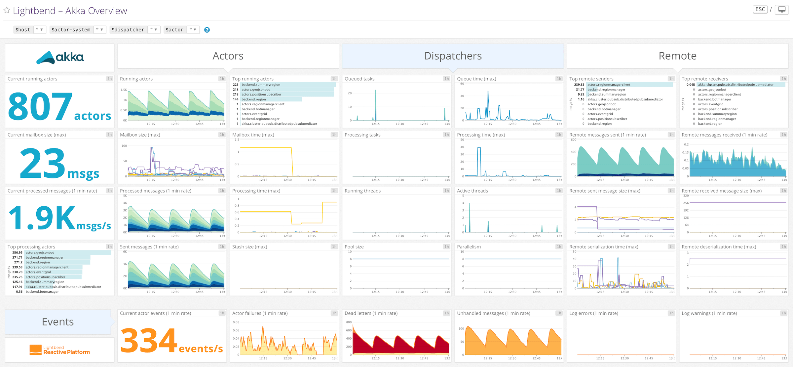
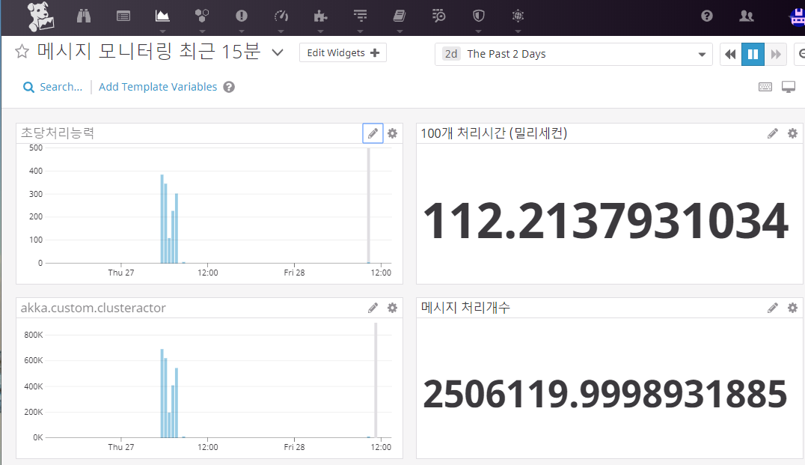

# ActorSystem 모니터링

어플리케이션에서 생성하는 정보를 분석하고,모니터링 하기 위해서 다음과 같은 방법을 일반적으로 사용합니다.

- 로그를 적재한다. ( Nlog,Log4j등등 모듈)
- 로그를 통합한다. ( 엘라서틱 로그 스태쉬)
- 로그를 대시보드화하고 분석한다 ( 키바나등 )

하지만, 대용량 이벤트에대해 실시간성으로 모니터링을 하고 싶다고 하면

Matrix를 활용한 성능 모니터링을 추가로 활용하게 됩니다.

 
# 액터 메시징 모니터링

기본적인 시스템 모니터링(CPU,네트워크,메모리등)외에 어플리케이션 내부(GC,Object수등)를 

모니터링 하는것을 APM(Application Performance Monotoring)이라고 합니다.

하지만 이것보다 더작은 단위, 리얼타임으로 전송되는 액터에서 발생하는  이벤트 자체를

성능 모니터링화 할수도 있습니다.

다음 링크는,오리지널 JVM AKKA버전에서 Akka시스템에 모니터링을 연동하는 메뉴얼입니다.

link : https://developer.lightbend.com/docs/telemetry/current/introduction/introduction.html

# Akka.net 모니터링 연동하기

Akka.net 에서도 여러가지 모니터링 시스템과 연동이 가능하며

대표적인 성능수집 모니터링 시스템에 Matrix 전송이 가능합니다.

## 모니터링 방식 결정

성능 수집 모니터링은 
OS내장(PerformanceCounters), 오픈소스 설치형(Prometheus), Sass(Datadog)
으로 나뉠수 있으며 방식에 따라 다음과 같이 크게 두가지가 있을수 있습니다.

- 로컬 Matrix 서버를 구동하고, 모니터링은 API를 통해 Matrix정보를 획득하는방식
- Agent가 Matrix자체를 전송만 하고, 모니터링 서버는 수집을 받는 방식

선택지에 따라 구축에 따른 난이도및 비용이 달라질수 있으며

선택된 모니터링과 적합한 모듈을 어플리케이션 내에 설치하여 사용가능합니다.

모니터링 구축에대한 내용은 생략합니다.

<pre>
Install-Package Akka.Monitoring.StatsD
Install-Package Akka.Monitoring.ApplicationInsights
Install-Package Akka.Monitoring.PerformanceCounters
Install-Package Akka.Akka.Monitoring.Datadog
Install-Package Akka.Akka.Monitoring.Prometheus
</pre>

## 모니터링 어플리케이션에 탑재

어플리케이션에 모니터링 기능을 탑재하기위해, 어플리케이션이 구동되는시점

ActorMonitoringExtension.RegisterMonitor() 를 통해 ActorSystem과 모니터링 설정을 연결해주기만 하면됩니다.

샘플코드는 다양한 모니터링과 연동되는지 확인하기위해 여러 모니터링을 구축하고, 잘 작동하는지 검증 하였으며

무난하게 잘 작동하였으며 선택된 하나의 모니터링만 사용하면 되겠습니다.

구축후기는 Sass형태의 Datadog 무료버전이 가장 무난하고 심플하게 셋팅진행 되었으며

기존 구축된 모니터링 시스템이 없거나, 연습용으로 진행시 DataDog을 추천합니다.

<pre>

public void Configure(IApplicationBuilder app, IWebHostEnvironment env, IApplicationLifetime lifetime){
...
    lifetime.ApplicationStarted.Register(() =>
    {                
        ....
                    switch (MonitorTool)
                    {
                        case "win":
                            var win = ActorMonitoringExtension.RegisterMonitor(actorSystem,
                                new ActorPerformanceCountersMonitor(
                                    new CustomMetrics
                                    {
                                        Counters = { 
                                            "akka.custom.metric1","akka.custom.metric2","akka.custom.metric3",
                                            "akka.custom.received1", "akka.custom.received2" },
                                        Gauges = { "akka.gauge.msg10", "akka.gauge.msg100", "akka.gauge.msg1000", "akka.gauge.msg10000" },
                                        Timers = { "akka.handlertime" }
                                    }));
                            
                            // 윈도우 성능 모니터링 수집대상항목은 최초 Admin권한으로 akka항목으로 레지스트리에 프로그램실행시 자동 등록되며
                            // 커스텀항목 결정및 최초 1번 작동후 변경되지 않음으로
                            // 수집 항목 변경시 아래 Register 삭제후 다시 최초 Admin권한으로 작동
                            // Actor명으로 매트릭스가 분류됨으로 기능단위의 네이밍이 권장됨
                            // HKEY_LOCAL_MACHINE\SYSTEM\CurrentControlSet\Services\Akka\Performance
                            break;
                        case "azure":
                            var azure = ActorMonitoringExtension.RegisterMonitor(actorSystem, new ActorAppInsightsMonitor(appConfig.MonitorToolCon));
                            break;
                        case "prometheus":
                            // prometheusMonotor 를 사용하기위해서, MerticServer를 켠다...(수집형 모니터)
                            // http://localhost:10250/metrics
                            metricServer = new MetricServer(10250);
                            metricServer.Start();
                            var prometheus = ActorMonitoringExtension.RegisterMonitor(actorSystem, new ActorPrometheusMonitor(actorSystem));
                            break;
                        case "datadog":
                            var statsdConfig = new StatsdConfig
                            {
                                StatsdServerName = StatsdServerName,
                                StatsdPort = StatsdPort                                
                            };
                            var dataDog = ActorMonitoringExtension.
                                RegisterMonitor(actorSystem, new ActorDatadogMonitor(statsdConfig));
                            break;
                    }
</pre>

## 메시징 카운팅하기

모니터링 탑재를 하였다고 하면, 모든 액터구현체는

Context.IncrementCounter 와 같은 이벤트 카운팅이 가능하며, 지정된 성능 모니터링의 매트릭스로 전송되게 됩니다.

다음과 같은 성능과 관련된 기능을 사용할수 있습니다.

- IncrementActorsCreated
- IncrementActorsRestarted
- IncrementActorsStopped
- IncrementMessagesReceived
- IncrementUnhandledMessages - logged automatically
- IncrementDeadLetters - logged automatically
- IncrementErrorsLogged - logged automatically
- IncrementWarningsLogged - logged automatically
- IncrementDebugsLogged - logged automatically
- IncrementInfosLogged - logged automatically
- IncrementCounter - for custom counters.
- Timing - for timing custom events, such as the amount of time needed to process a mailbox.
- Gauge - for recording arbitrary non-counter metrics, such as the average size of a message.

이벤트의 집계수집을 위해 One Event,One Rest API를 호출하는것은 성능적으로 비효율적입니다.
다음 코드는, 액터를 이용하여  10만건 이벤트를 발생하고 성능카운팅을 하는 샘플코드로
성능 보고기능을 탑재하였다고 우려할만한 큰 성능저하는 일어나지 않습니다. (미비한 수준으로 영향을 끼치기는 합니다.)
대용량의 카운팅 측정을 위해 로깅을 활용 하는 방식보다는 훨씬 경제적입니다.

기본 액터가 가진 Context를 통해 이용가능하며 기본 액터에대한 설명은 생략합니다.
<pre>
// 사용부 : 10만 이벤트 발생
for (int i = 0; i < 100000; i++)
    MonitorActor.Tell(value);
 
// 구현부 : 카운팅 이벤트를 발생할수 있음
ReceiveAsync<string>(async msg =>
{
    int auto_delay = random.Next(1, 100);  //이벤트가 불규칙 대량 작동된다고 가정
    await Task.Delay(auto_delay);
    Context.IncrementCounter("akka.custom.metric1");  // 1단위로 증가
    Context.IncrementCounter("akka.custom.metric2",100); // 특정 단위로 증가(만약 100개 벌크 처리받았다고 하면 100카운팅 증가를 한번에할수 있습니다.)
});
</pre>

## 메시징 대시보드 구현

이렇게 수집된 성능 매트릭정보는, 성능 모니터링 툴에의해 대시보드화가 가능합니다.

여기서 설명하는 자료가 작동하는지 확인하기 위해 DataDog을 이용하였습니다.

참고 링크 :
- Akka.net 모니터링 모듈 : https://github.com/petabridge/akka-monitoring
- Akka.net 모니터링 사용기 :  http://wiki.webnori.com/display/webfr/Real+time+performance+counters
- 데이터독: https://www.44bits.io/ko/keyword/datadog
