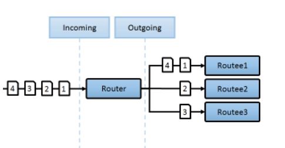
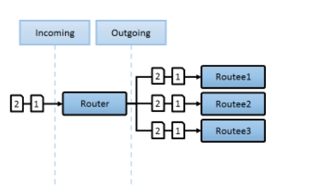
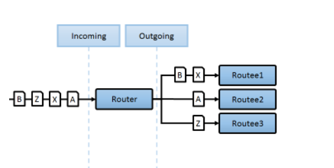
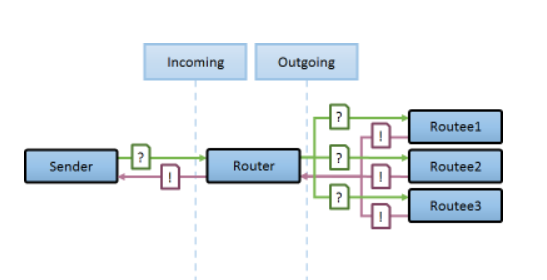
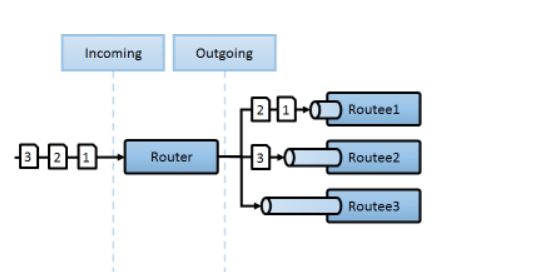

# 라우팅을 이용한 AKKA 분산처리 전략

AKKA에서는 동시성 분산 처리를 위해 네트워크 분산처리에서 활용되는
스위칭 컨셉을 사용한다. 
액터모델의 특징과 함께 이것은  로컬에서 구현한것을 원격에 배포된 액터에 적용함으로 
로컬에서 개발된 구현체가, 코드변경없이 원격 분산처리가 될수있는 장점이 있다.

AKKA에서 라우팅이라고 불리며, 네트워크 스위치에서 활용되는 로드밸런스
컨셉과 유사하다. AKKA의 기능을 배우기전에 네트워크 스위칭을 간략하게 알아보자

## 네트워크 스위칭 - 로드밸런스

네트워크에서 L2, L3, L4, L7 스위치를 구별하는 것은 

스위칭이 OSI 7 Layer 중 어느 Layer 에서 수행되는가에 따라 결정된다. 

정보 
- OSI7 Layer에따른 스위칭 :  https://se-sik.tistory.com/74
- AWS ELB -  https://aws.amazon.com/ko/elasticloadbalancing/

<pre>
    AWS-ELB를 아무생각없이 사용하고 있다고 하면 
    ELB의 순간최대 TPS 처리능력은 "1024" 밖에 되지 않는다.
    대량의 TPS를 처리하기위해 OSI7 Layer에따른 LB 종류와, 
    클라우드를 사용한다면 클라우드에서 지원하는 LB의 Type별
    성능을 알아둘필요가 있다.
</pre>

AKKA에서는 이러한 LB 기능에 사용되는 라우팅을 직접 코드설계에 반영하여
어플리케이션 자체에 내재화된 기능으로 사용할수 있다. 

## Akka 라우팅

로드밸런싱은 부하를 분산한다란 의미로 주로 컴퓨터 네트워크의 기술의 하나이며
다음 3요소를 가지고 있다.

- 라우팅 : 경로를 선택하는 과정 또는 방법
- 라우터 : 분기가 되는 입구
- 라우티 : 분기가된 출구와 연결된 최종목적지

### RoundRobin

 들어온 메시지 순서대로, 순차적으로 대상 노드를 바꿔가며 전송시 사용 가장 심플하며 상태가 없는 REST 서비스에서 가장많이 활용이된다.

### BroadCast

분산처리라기 보다, 동일한 메시지를 모든 라우티에게 전파함으로 모두에게 알리는 용도로 활용이 된다.
공통으로 공유하는 설정사항이 변경되었을때 활용될수 있다.

### ConsistentHashing

사용자가 정의한 해시키 기반으로, 동일한 값은 가급적 동일한 라우티가 처리할수 있도록 보장된다.
여기서 가급적이다라고 표현한것은 라우티를 제거했을경우 현재 라우티수 기준으로 분배가 변경될수 있기때문이다.
주로 상태를 가지고 있는 웹소켓 서비스에서 활용될수 있다. 웹소켓은 연결지향형이며 핸드쉐이크및
재연결등을 위해 IP기준으로 라우티를 유지하는게 좋다.

네트워크 스위칭 영역에서는 "source ip persistence" 라고 불리며, 웹소켓 로드밸런스를 한다고 하면 필수적으로 알아둘 필요가 있다.
AKKA의 영역에서는 구현을 직접할수 있기때문에 라우티의 빠른 로컬캐싱을 활용하여 분산처리할때 이용될수 있다.

### ScatterGatherFirstCompleted

라우티에 데이터가 불규칙하게 분포또는 중복되었을시, 가장 빠른 응답의 결과를 사용할때

### SmallestMailbox

라이티로 전달되는 작업의 처리시간이 불규칙할때, 덜바쁜 녀석에게 전달하여 빠른처리를 할수 있다.
확장버전으로 우선순위 역전도 가능하며, 우선순위를 높여 긴급메시지를 빠르게 처리하는것도 가능하다.

### TailChopping
기본적으로 랜덤 라우터이나, 최적 응답시간내에 반응못하면(5s)
마지막까지 처리는 하되 라우터에서 임시제외하여 쉴시간을 준다( 특정시간후 복귀됨-20s )

다음 누군가 접근시 제외되지 않은 녀석중에서 또 랜덤으로 작동하며
일반적으로 모두 안정적이나 , 가끔 불특정 노드가 느려져 쉴시간이 필요할 때 활용될수 있다.
모두가 느려지는 상황이 자주 발생하면 이전략을 사용 못하며 
라우티가 불규칙하게 GAC활동이 일어난다고 하면 활용할수 있다. (참고로 GAC가 일어나면 CPU자원을 일시적으로많이 사용하게되며,수행이 끝나면 CPU의 안정을 찾는다.)

## 사용법

유닛테스트기를 통해, 간단하게 라운드로빈을 구현해보자
분산처리되는 라우터를 구성하는데 한줄의 코드면 충분하며
로컬에서만 작동시 멀티스레드로 작동되지만, 
스레드를 개발하는 개발자의 역량에 따라 차이가 있을수 있지만
스레드풀을 이용하는 방식보다 더 직관적이고 심플할수 있습니다.
또한 코드 설계의 큰 변경없이 로컬->리모트->클러스터로의 확장이 용이합니다.

싱글톤 클러스터(클러스터내에 단하나만 작동하는 Actor)를 포함 클러스터는 이후에 다뤄보도록 하겠습니다.

    using Akka.Actor;
    using Akka.Routing;
    using Akka.TestKit;
    using AkkaDotModule.ActorSample;
    using AkkaNetCoreTest;
    using System;
    using Xunit;
    using Xunit.Abstractions;

    namespace TestAkkaDotModule.TestActors
    {
        public class RouterTest : TestKitXunit
        {
            protected TestProbe probe;

            public RouterTest(ITestOutputHelper output) : base(output)
            {
                Setup();
            }

            public void Setup()
            {         
                probe = this.CreateTestProbe();
            }

            /// 

            /// 사용목적 : 액터를 라운드 로빈으로 구성하고 분산처리할때
            /// 

            /// <param name="timeSec"></param>
            /// <param name="elemntPerSec"></param>
            [Theory(DisplayName = "fire를 5번 전송하면, 5개의 액터가 각각 균등처리 ")]
            [InlineData(3)]
            public void TestRoundRobbin(int expectedTestSec) 
            {
                var helloActor = Sys.ActorOf(Props.Create(() => 
                    new HelloActor("Pool5")).WithRouter(new RoundRobinPool(5)));

                Within(TimeSpan.FromSeconds(expectedTestSec), () =>
                {                
                    helloActor.Tell("fire1", this.TestActor);
                    helloActor.Tell("fire2", this.TestActor);
                    helloActor.Tell("fire3", this.TestActor);
                    helloActor.Tell("fire4", this.TestActor);
                    helloActor.Tell("fire5", this.TestActor);
                
                    // 응답메시지가 없음을 검사(대기)
                    probe.ExpectNoMsg(TimeSpan.FromSeconds(1));
                });
                /* 수행결과 - 유닛테스트 결과에서 확인가능하며 분산처리가됨 
                [INFO][2020-12-03 오후 3:30:29][Thread 0022][akka://test/user/$a/$b] [Pool5] : fire2
                [INFO][2020-12-03 오후 3:30:29][Thread 0024][akka://test/user/$a/$c] [Pool5] : fire3
                [INFO][2020-12-03 오후 3:30:29][Thread 0011][akka://test/user/$a/$d] [Pool5] : fire4
                [INFO][2020-12-03 오후 3:30:29][Thread 0010][akka://test/user/$a/$a] [Pool5] : fire1
                [INFO][2020-12-03 오후 3:30:29][Thread 0023][akka://test/user/$a/$e] [Pool5] : fire5
                */
            }
        }
    }

Links: 더자세한 Router종류와 사용법을 알고 싶으면 다음 원문링크를 참고
- 원문 : https://getakka.net/articles/actors/routers.html
- 리모트로 분산처리확장하기 : http://wiki.webnori.com/display/AKKA/remote-router
