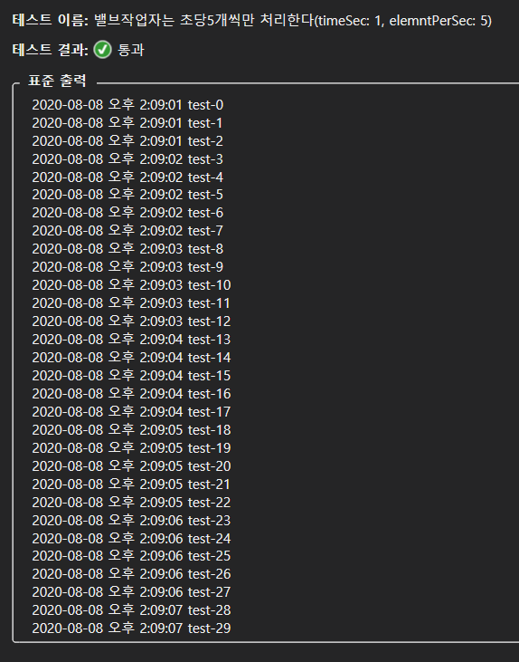

# AkkaDotModule

프로젝트명 : 아카닷부트

닷넷 환경에서 AKKA의 모듈을 공통화하고 AKKA.NET을 학습할수 있는 환경을 제공하여

닷넷코어에서 유용한 메시지 큐처리를 다양한 프로젝트에서 심플하게 사용할수 있게 하는것이 목표입니다.

버전업이 될때마다 유용한 커스텀 액터모델을 제공및 설명하며, 액터와 API에서 사용 샘플을 동시에 추가합니다. 

# 주요 릴리즈 노트

- 1.0.2 : 메시지 우선순위([PriorityMessageMailbox](TestAkkaDotModule/TestActors/PriorityMessageMailboxTest.cs)) 처리기 추가
- 1.0.1 : 기본 액터([TestActors](TestAkkaDotModule/TestActors/HelloActorTest.cs)) 사용법추가
- 1.0.0 : Nuget에서 AkkaDotModule.Webnori 로 검색하여 설치가능
- 0.0.9 : DotNetAPP에서 AkkaDotModule을 쉽게사용하기위한 AkkaLoad 를 추가
- 0.0.8 : 조절기([ThrottleWork](TestAkkaDotModule/TestActors/ThrottleWorkTest.cs)) 추가, 메시지를 대량인입하고 조절기에서 안전한 속도제어가 필요할때 사용

# AkkaDotBootApi

AkkaDotModule 를 닷넷코어 API에서 활용하는 샘플을 살펴볼수 있습니다.

[APiControllers](AkkaDotBootApi/README.md)

# 모듈 테스트

여기서 작성되는 모듈은 버전업시 유닛테스트를 자동 수행하고 있습니다.

유닛테스트는 사용법을 스스로 설명하고 검증하기때문에 별도의 사용 메뉴얼이 필요하지 않습니다.

    dotnet test TestAkkaDotModule

Visual Studio 테스트 탐색기에서 검증결과 확인가능합니다.

# Nuget 경로

    https://www.nuget.org/packages/AkkaDotModule.Webnori/

    dotnet add package AkkaDotModule.Webnori --version x.x.x

# 지원기능

- HelloActor : AKKA입문시 처음봐야할 기본 액터 다루기
- ThrottleWork : 스트림의 속도 제어가 필요할때 밸브의 잠금기능을 활용
- PriorityMessageMailbox : 동시에 발생하는 메시지의 우선순위 조절이 필요한경우

[More Detail](AKKAUSING.md)

# 닷넷어플리케이션 탑재

##  akka.conf / akka.Development.conf 추가

    akka {
        loggers = ["Akka.Logger.NLog.NLogLogger, Akka.Logger.NLog"]
        loglevel = debug
    }

## Startup.cs 수정

    public void ConfigureServices(IServiceCollection services)
    {
        services.AddControllers();

        // Akka 셋팅
        var envName = Environment.GetEnvironmentVariable("ASPNETCORE_ENVIRONMENT");
        var akkaConfig = AkkaLoad.Load(envName, Configuration);
        actorSystem = ActorSystem.Create("AkkaDotBootSystem", akkaConfig);            
        services.AddAkka(actorSystem);
    ...................
    }    
    public void Configure(IApplicationBuilder app, IWebHostEnvironment env, IApplicationLifetime lifetime)
    {
        lifetime.ApplicationStarted.Register(() =>
        {
            // 밸브 Work : 초당 작업량을 조절                
            int timeSec = 1;
            int elemntPerSec = 5;
            var throttleWork = AkkaLoad.RegisterActor("throttleWork", 
                actorSystem.ActorOf(Props.Create(() => new ThrottleWork(elemntPerSec, timeSec)), "throttleWork"));

            // 실제 Work : 밸브에 방출되는 Task를 개별로 처리
            var worker = AkkaLoad.RegisterActor("worker", actorSystem.ActorOf(Props.Create<WorkActor>(), "worker"));
            // 배브의 작업자를 지정
            throttleWork.Tell(new SetTarget(worker));
        });
    }

## 사용
    IActorRef throttleWork = AkkaLoad.ActorSelect("throttleWork");
    var batchList = new BatchList(batchDatas.ToImmutableList());
    throttleWork.Tell(batchList);
            

## 추가 참고자료
 - https://getakka.net/ : Akka.net Origin - 본 저장소는 Akka.net(한글)입문을 도와주며 AKKA의 고급 학습은 원문사이트에서 하는것을 권장합니다. 
 - http://wiki.webnori.com/display/AKKA : AKKA의 전반적인 컨셉
 - http://wiki.webnori.com/display/webfr/AKKA+Setting+For+NetCore : NetCoreAPI에 AKKA 탑재
 - http://wiki.webnori.com/display/webfr/GitHub+Action+With+Nuget+Package : Github에서 개인 Nuget Package 활용법 
